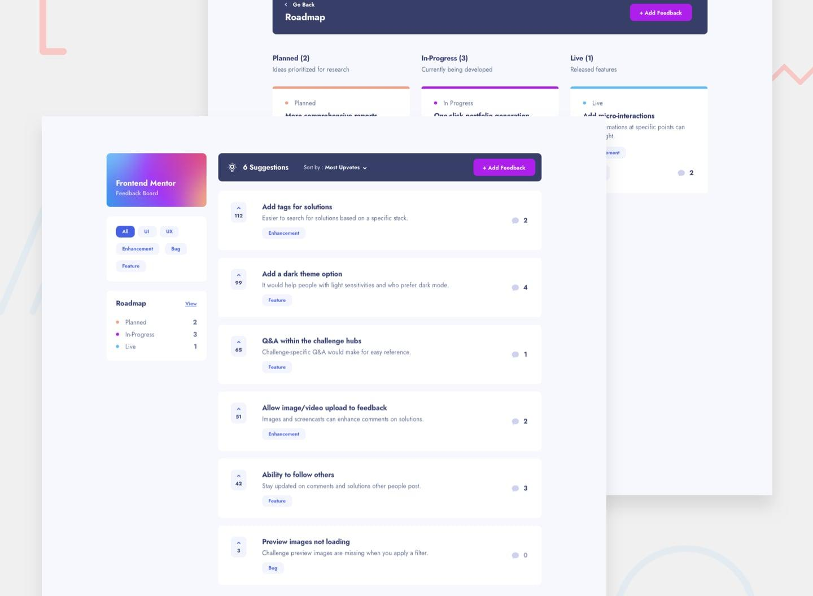

# 🗳️ Product Feedback App

A full-featured feedback board built with Next.js, Tailwind CSS, and Zustand — based on the [Frontend Mentor](https://www.frontendmentor.io/challenges/product-feedback-app-wv1gJVtYb) challenge. Users can submit feedback, upvote suggestions, comment and reply, and view the roadmap.



---

## 🚀 Features

- ✅ View and filter suggestions by category
- ✅ Sort feedback by upvotes or comment count
- ✅ Upvote/un-upvote feedback
- ✅ Add new feedback
- ✅ Comment on feedback
- ✅ Reply to comments (with replyingTo tracking)
- ✅ Drag & drop roadmap to change status (planned, in-progress, live)
- ✅ Persistent state via Zustand
- ✅ LocalStorage sync (feedback, upvotes, comments)
- ✅ Responsive design matching Figma spec
- ✅ Light & dark mode with Tailwind 4
- ✅ Accessible and keyboard-navigable UI

---

## 🧱 Tech Stack

| Category       | Tools / Libraries                        |
|----------------|-------------------------------------------|
| Framework      | [Next.js 15+](https://nextjs.org)         |
| Styling        | [Tailwind CSS 4](https://tailwindcss.com) |
| State Mgmt     | [Zustand](https://zustand-demo.pmnd.rs/)  |
| Animation      | Framer Motion                             |
| UI Components  | Custom, ShadCN, Lucide Icons              |
| Data Layer     | LocalStorage (temporary)                  |
| Types          | TypeScript with strict mode               |
| Fonts          | [Jost](https://fonts.google.com/specimen/Jost) via Figma spec |

---

## 📁 Project Structure

```
src/
  ├── components/
  │   ├── feedback/
  │   ├── roadmap/
  │   └── shared/
  ├── context/
  ├── hooks/
  ├── store/
  ├── types/
  ├── utils/
  └── pages/
```

---

## ✅ Current Status

| Module         | Status         |
|----------------|----------------|
| Global state   | ✅ Zustand complete |
| Feedback board | ✅ Functional |
| Sorting/filter | ✅ Done       |
| Comments       | ✅ Nested replies supported |
| Roadmap        | ✅ Drag-and-drop working |
| Responsive UI  | ✅ Spec-matching |
| Styling        | 🛠️ Final polish underway |
| Tests          | 🚧 Coming soon |

---

## 🧠 Next Steps

- [ ] Wire up form validation
- [ ] Write unit tests with Vitest or Jest
- [ ] Add animation polish for roadmap
- [ ] Add toast notifications
- [ ] Connect to backend (optional)

---

## 🧑‍💻 Author

**Andrew Teece**  
Frontend Developer — React, Next.js, TypeScript  
[Portfolio](https://andrewteece.com) • [GitHub](https://github.com/andrewteece)

---

## 📄 License

This project is open-source for learning purposes.  
Original design by Frontend Mentor.
